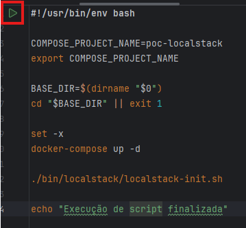
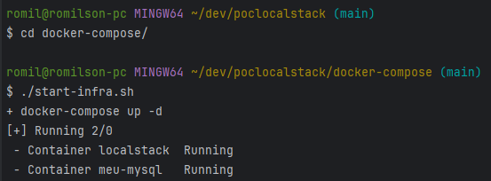

# POC LocalStack

## Descrição

Este projeto é uma aplicação Java desenvolvida com Spring Boot. A aplicação utiliza Docker para criar ambientes isolados e LocalStack para simular serviços AWS localmente.

## Requisitos

Antes de começar, certifique-se de que você tenha as seguintes ferramentas instaladas:

- [Java 17 ou superior](https://www.oracle.com/java/technologies/javase-jdk17-downloads.html) (ou [OpenJDK](https://openjdk.java.net/))
- [Git Bash](https://git-scm.com/downloads)
- [Maven 3.3.2 ou superior](https://maven.apache.org/download.cgi) 
- [Docker](https://www.docker.com/products/docker-desktop)
- [Docker Compose](https://docs.docker.com/compose/)

## Configuração do Ambiente

### Passo 1: Clonar o Repositório

Clone o repositório do projeto para sua máquina local:

```bash
git clone https://github.com/romilson80/poclocalstack.git
```
Para executar a infraestrutura da aplicação certifique-se que o Docker está em execução. Navegue até 
o diretorio docker-compose/start-infra.sh e aperte o botão play verde e veja a mágica acontecer.



A infra da aplicação também poderá ser iniciada atravez de linha de comando do bash como mostrado na imagem abaixo:

